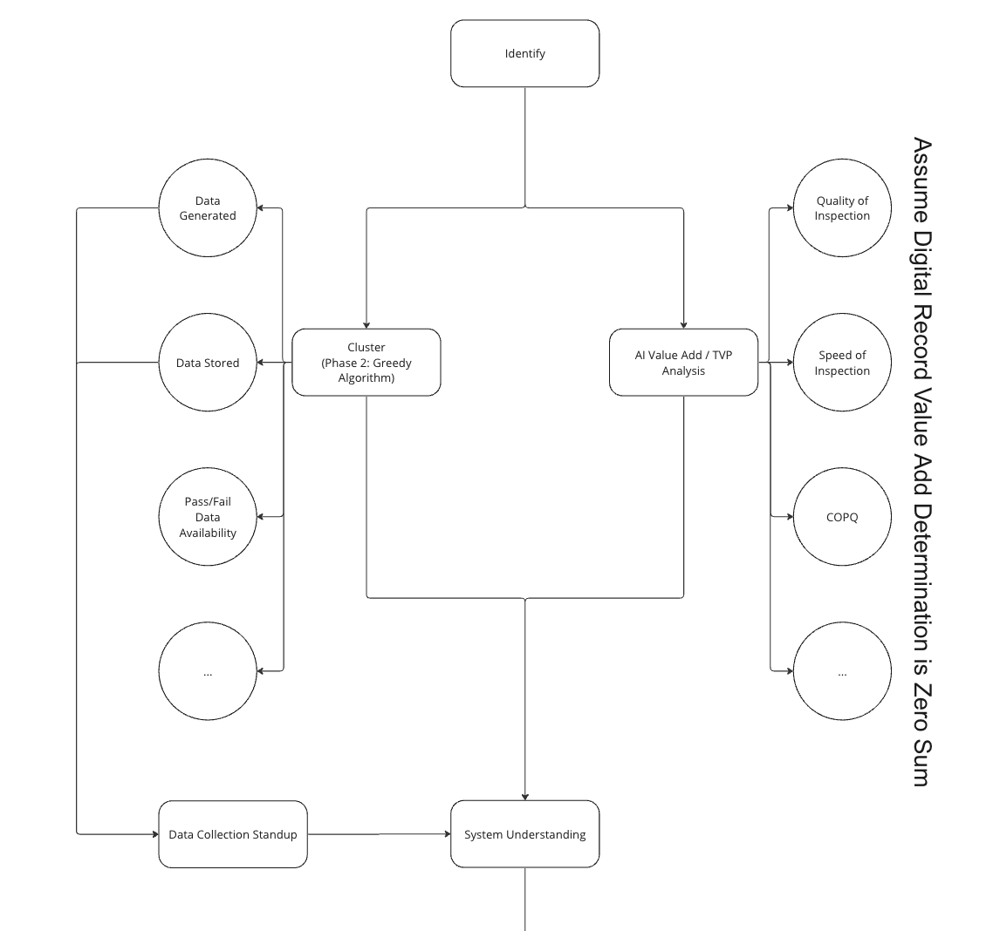

# Sigma Plant

## TODO:

- [ ] Zone should have knowledge of contained features:

  - [ ] group moving
  - [ ] duplication
  - [ ] station list

- [ ] Processes can have 'sub process' which are actually 'Sub Plants'

  - [ ] to show sub processes need a level naviagation widget as above
  - [x] sub process plants need special Source / Sink zones for the input and output of the higher level process
  - [x] figure out why they are dissapearing sometimes when levels change
  - [x] ~~'add sub process' on station block~~ All Processes have a Source, Delay, and Sink. THey can have a description on a higher level. They can also have more blocks inside them, but this is how they shoudl initialise.
  - [ ] formalize parent navigation
  - move components between themes (copy paste I guess)
  - [ ] data should be stored in a tab style layout INFO, TAGs, special tab to enter sub process,

- [x] Conectors should come straight out, then choose a sensible path the the source
- [x] Conectors should be deletable
- [x] Connectors should be initi w/ both inp and outp
- [ ] Connectors should be categorizable

- [ ] Inputs and Outputs should be addable components to subprocesse

  - [ ] Tags for Material / Informational / Energy / Mechanical / Custom
  - [ ] Created by adding sources or sinks in the process, consider the Station block above as now having multiple ins/outs (update to match + tags)

- [ ] Split/Merge Block with Percentages (two way only, slider split maybe)

  - [x] Implment base
  - [ ] Handle multiple outputs (on Connector side?)

- [ ] Sigma Block

  - [x] Implment base
  - [ ] Time and Cost modes, what else?

- [ ] Feature Tagging:

  - Value Add
  - No-Value Add
  - Mandated Necessary
  - Waste
  - Rework
  - Handoff

- [ ] Map and time between any Source and Sink

- [x] Mobile touch input

### Requires Server

- [ ] Undo and constant save
- [ ] Real Time collaboration

## Process Evaluation

```

Supplier   Frame Assembly   Wheel Assembly   Final Assembly   Customer
  |            |                |                |                |
  V            V                V                V                V
Raw Materials->Frames---------->Frames with----->Finished Bikes-->Delivered
               (Data)           Wheels           (Data)
               (Data)           (Data)

```

(missing Work In Progress inventory and information flow)

Value Stream Mapping (VSM) is a visualization tool used in the Lean methodology that helps to understand the flow of value in a process, from the start of production to delivering the end product to the customer. It's a powerful tool for identifying waste and inefficiencies, enabling targeted improvements.

To illustrate, let's consider a simplified three-step process in a bicycle factory:

1. **Frame Assembly**: The bicycle frame is assembled from various parts.
2. **Wheel Assembly**: The wheels are built, tires are mounted, and then attached to the frame.
3. **Final Assembly**: The remaining components (like handlebars, gears, brakes, etc.) are attached to the assembled frame and wheels.

In each of these steps, we would look at the following elements while creating a value stream map:

**Process Steps**: These are represented as boxes in the VSM. Each step in the process would be a separate box (Frame Assembly, Wheel Assembly, and Final Assembly in our case).

**Flow of Materials**: This is represented as solid arrows in the VSM. The arrows show the flow of materials from one process step to another.

**Information Flow**: This is represented as dashed lines in the VSM. The lines indicate the flow of information, such as work orders.

**Data Boxes**: These are placed underneath each process step and contain relevant data about that step. This can include things like cycle time (the time to complete one cycle of the process), changeover time (the time required to switch from making one product variant to another), uptime, scrap rate, etc.

**Inventory**: These are represented by a triangle. Inventory or work-in-progress (WIP) between process steps is noted down.

**Customer/Supplier**: The VSM starts with the supplier providing raw materials and ends with the customer receiving the finished product.

So, for the bicycle factory, a simple VSM might look something like this:

```
Supplier --raw materials--> Frame Assembly --frames--> Wheel Assembly --frames with wheels--> Final Assembly --finished bikes--> Customer
```

Beneath each process (Frame Assembly, Wheel Assembly, and Final Assembly), we would have data boxes containing information about cycle time, changeover time, scrap rate, etc. for that process. If there's any inventory between processes, it would be represented by a triangle between the processes.

Once we have this map, we can start looking for ways to improve the process. This might involve reducing cycle time, decreasing inventory, improving the flow of information, or other strategies. By identifying these opportunities and making improvements, we can increase the value delivered to the customer and reduce waste.



Process mapping in the context of a plant or factory operations is a technique for visualizing and understanding the sequential steps involved in the production or operations process. It can be a very effective tool for generating quantitative data regarding the operations. Here's how:

1. **Identifying Bottlenecks**: Process mapping can help identify bottlenecks in the production process. Bottlenecks are points in the process where work piles up because it arrives too quickly to be handled. Once identified, you can measure the throughput at these points to quantify the severity of the bottleneck.

2. **Measuring Time**: With a process map, you can measure the time it takes for a product to move through each step of the process, which is often referred to as cycle time. This can help quantify efficiency and identify opportunities for improvement.

3. **Work-In-Progress (WIP)**: Process mapping can help visualize and measure the amount of work-in-progress inventory at different stages in the process.

4. **Cost Analysis**: Each step in a process map can be associated with certain costs, such as labor, energy, or materials. By analyzing these costs, you can generate quantitative data about the cost-effectiveness of different steps in the process.

5. **Failure Modes**: Process mapping can help identify points in the process where errors or failures are most likely to occur. Once these points are identified, you can measure the failure rate to quantify the reliability of the process.

6. **Value Stream Mapping**: This is a lean-management method for analyzing the current state and designing a future state for the series of events that take a product or service from the beginning of the specific process until it reaches the customer. This can provide a lot of quantitative data, including process times, lead times, and information relating to waste.

7. **Throughput and Capacity**: Process mapping can help quantify the throughput (the rate at which a system generates its products/services per unit of time) and capacity (the maximum output that the system can produce) of the overall system or of specific subprocesses.
